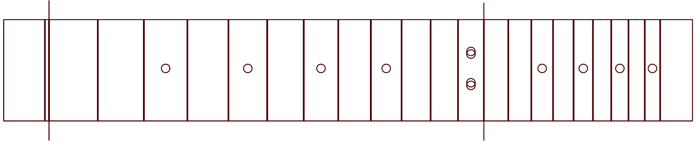

What is this?
=============

This is a template designed to let you use a laser cutter to etch fret slot grooves to then be sawn for a 21 fret, 25.5" scale length fretboard. The nut width is 3.5mm.

It is provided free to use under the Creative Commons 4.0 ShareAlike license, copyright Michael Dales 2017.

How to use this?
================

The design here is intended to be used as the first pass of cutting fretboard slots to make guiding groves before you cut them with a saw. The slots are 0.5mm wide, on the assumption you will use a 0.3mm wide saw such as a Japanese Dozuki Back saw to cut the actual slots. 

Most fret wire have a tang width of 0.5mm, so using a 0.3mm fret saw means that you can hammer the frets into the slots without using any glue to hold them in.

The rough workflow I've used successfully is:

1: Take the fretboard wood, and laser on the fret groves - the bounding box and dot inlays are in the DXF file for reference, but I do not cut or etch them.

2: There is a marker for the 0th and 12th Fret, etch those also, and use it to line up with your neck piece.

3: Glue the etched fretboard to your neck.

4: Before radiusing, use your dozuki saw to cut the fret slots, remembering that as you radius the board you will lose wood at the edge.

5: Hammer in the frets without using glue.